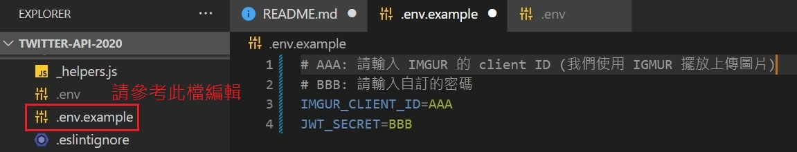
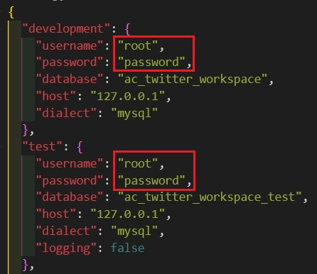

# twitter-api-2020

ALPHA Camp | 學期 3 | Simple Twitter |

### Introduction

這是一個給前端使用的 API

### Environment

請先確定您有安裝 MySQL Workbench  
或已建置同等的 DB 環境

### Installation Guide

1. 使用終端機將專案 clone 至本地

```
git clone https://github.com/chikunmark/twitter-api-2020.git
```

2. 進入到專案資料夾

```
cd twitter-api-2020
```

3. 安裝相關套件

```
npm install
```

4. 建立.env 檔案，並參考/.env.example，放入環境變數 (提示如下圖)
   

5. 開啟./config/config.json 檔案，您會看到範例帳密 (如下圖)，  
   請修改成您在本地使用的帳號密碼，若未設定，敬請自訂一組
   

6. 使用 MySQL Workbench 語法建立資料庫

- 建立 dev 用 DB
  ```
  drop database if exists ac_twitter_workspace;
  create database ac_twitter_workspace;
  ```
- 建立測試檔用 DB
  ```
  drop database if exists ac_twitter_workspace_test;
  create database ac_twitter_workspace_test;
  ```

7. 建立 tables

```
npx sequelize db:migrate
```

8. 載入種子資料

```
npx sequelize db:seed:all
```

9. 啟動伺服器

```
npm run dev
```

10. 在終端機看到以下字串代表伺服器建立成功

```
Example app listening on http://localhost:3000
```

11. 利用 Postman 連接 API 伺服器
12. 在 Postman 使用下方路由

```
POST http://localhost:3000/api/users
```

- 並在 Body 部分輸入以下帳號，即可登入前台

  ```
  {
    "account": "user1@example.com",
    "password": "12345678"
  }
  ```

- 輸入以下帳號則可登入後台
  ```
  {
    "account": "root@example.com",
    "password": "12345678"
  }
  ```

13. 取得 Token 後，即可開始測試各條路由

```
{
    "success": "true",
    "data": {
        "token": "...",
}
```

### API Endpoints

請參考

- https://documenter.getpostman.com/view/26339461/2s93RNyudo#intro

### Authors

- [chikumark](https://github.com/chikunmark)
- [LinTzuAn](https://github.com/LinTzuAn)
