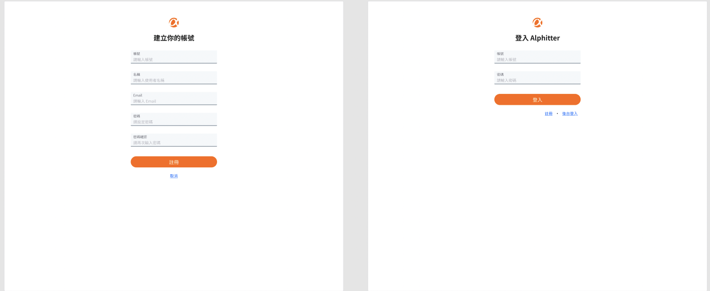
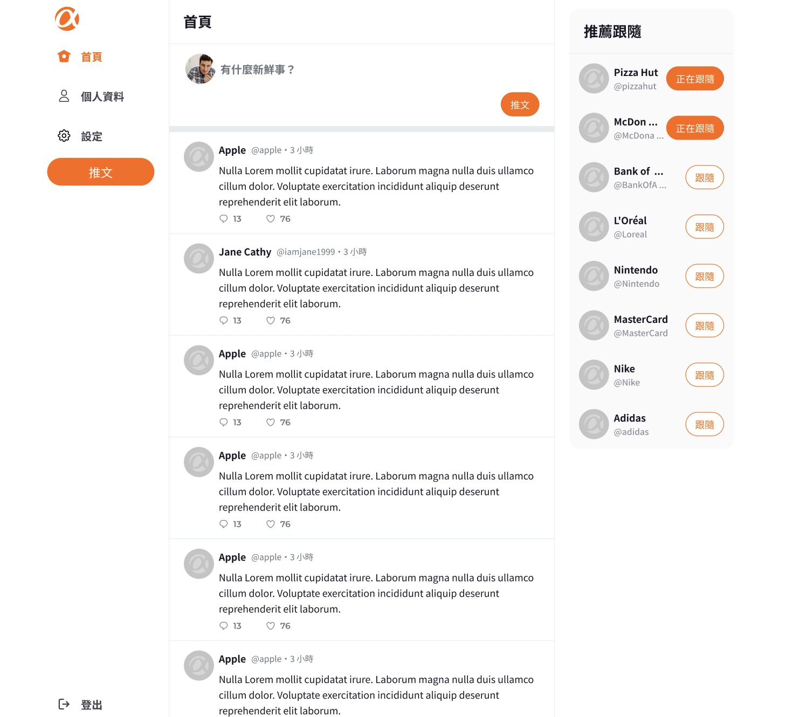
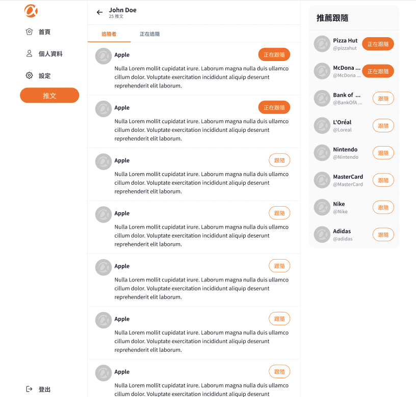
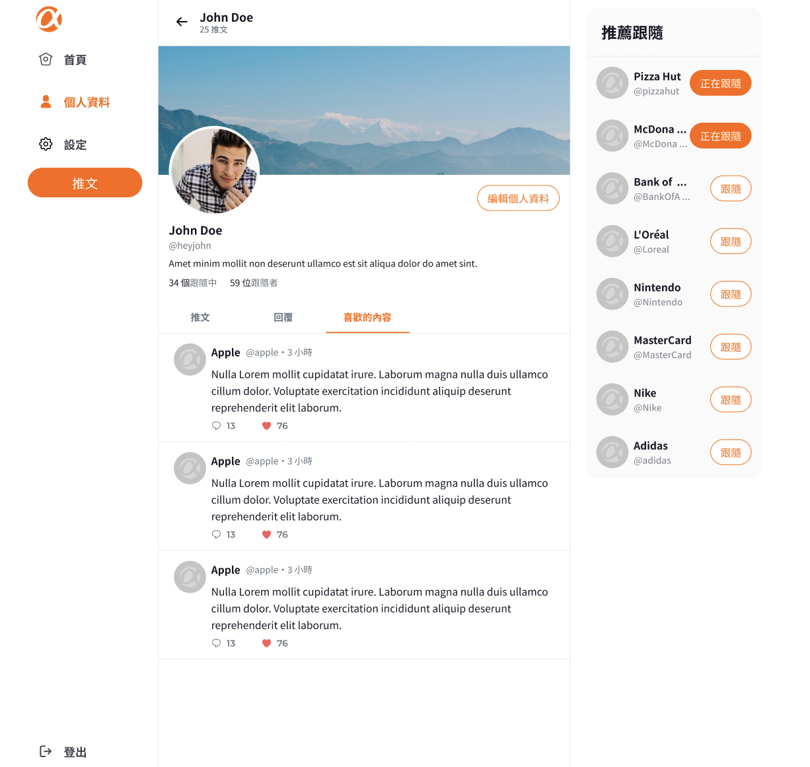

# **Simple Twitter**

## 📖 Introduction

****

It’s an API server for [Simple Twitter website](https://kim716.github.io/ac_twitter/login). Users can log in to the account using the following information.

| Role | account  | password |
| --- | --- | --- |
| general user | user1 | 12345678 |
| admin | root | 12345678 |

Visit the Front-end Github [repo](https://github.com/Kim716/ac_twitter).

## 🎮 Features

**Register/ Log in/ Log out**

- Other than the registration and login pages, users must log in to use the website
- When an unregistered user attempts to log in, an error message will be displayed
- During registration, users can set their account, name, email, and password
- Users can edit their account, name, email, and password
- In registration/editing, the account and email cannot be duplicated with others. If there is a duplicate, an error message will be displayed
- Users can edit their name, self-introduction, avatar, and cover photo



**Tweets/ Replies**

- Users can browse all tweets on the home page
- Users can add new tweets
- Users can reply to other people's tweets
- Users can view the post and its corresponding reply thread by clicking on the post button located on the left side
- Clicking on a user's avatar in a post allows users to browse that user's profile and posts.
- Users are not able to reply to other users' replies or to like/dislike other users' replies



**User interactions**

- Users can follow/unfollow other users (cannot follow themselves)
- Users can like/unlike other people's posts



**Data Summary**

- Users can view the number of followers and followings for a specific user
- Any logged-in user can browse the following information of a specific user
- Users can see a recommended list of followers on the sidebar of the homepage
- The recommended list is ranked by the number of followers, with the top 10 displayed



**Admin Backstage (only admin can log in)**

- The admin can access the website backend through a dedicated login page
- The admin can browse a list of all Tweets on the website
- The admin can browse the list of all users on the site


## 🛠️ Installation

```
# Clone this repository
$ git clone https://github.com/Noelle-KH/twitter-api-2023.git

# Confirmed the terminal is at the project
cd twitter-api-2023

# Project setup & Install nodemon
$ npm install
$ npm i nodemon

# Set environment variables in .env file according to .env.example
touch .env

# Modify config.json with your own MySQL username, password, and database
development": {
    "username": "<your username>",
    "password": "<your password>",
    "database": "<your database>",
    "host": "127.0.0.1",
    "dialect": "mysql"
	}

# Create tables and seeders
$ npx sequelize db:migrate
$ npx sequelize db:seed:all

# Start the server
npm run dev

# Execute successfully if seeing following message
Example app listening on port 3000!

# To stop the project
ctrl + c
```

## 🥷🏻 Prerequisites

- [Git](https://git-scm.com/downloads)
- [Node.js](https://nodejs.org/en/)
- [Express](https://expressjs.com/)
- [Sequelize](https://sequelize.org/docs/v6/)
- [http-errors](https://www.npmjs.com/package/http-errors)

## 👩🏻‍💻 **Routes Table and API documents link**

[API documents](https://www.notion.so/API-Document-47a0c88c161148e0a3573cc1cf8ea668)

| Feature | Method | Route |
| --- | --- | --- |
| Routes related to (general) user | --- | --- |
| Sign up for an accoun |  POST  | /api/users |
| User login | POST  | /api/users/login |
| Viewing specific user information | GET  | /api/users/:id |
| Edit personal information of oneself | PUT  | /api/users/:id |
| View account settings of a specific user | GET  | /api/users/:id/setting |
| Edit account setting of oneself. | PUT  | /api/users/:id/setting |
| View tweets posted by a specific user | GET  | /api/users/:id/tweets |
| View tweets that a specific user has replied to | GET  | /api/users/:id/replied_tweets  |
| View the posts that a specific user has liked | GET  | /api/users/:id/likes |
| View the list of users that a specific user is currently following | GET  | /api/users/:id/followings |
| View the followers of a specific user | GET  | /api/users/:id/followers |
| Routes related to Tweet | --- | --- |
| View all tweets | GET  | /api/tweets |
| Add a new tweet | POST  | /api/tweets |
| View top ten users by number of followers | GET  | /api/tweets/topUsers |
| View a specific tweet | GET  | /api/tweets/:tweet_id |
| Add a reply to a specific tweet | POST   | /api/tweets/:tweet_id/replies |
| View replies to a specific tweet | GET  | /api/tweets/:tweet_id/replies |
| Like tweet |  POST  | /api/tweets/:tweet_id/like |
| Unlike tweet | POST  | /api/tweets/:tweet_id/unlike |
| Routes related to Followship | --- | --- |
| Add a follow | POST  | /api/followships |
| Unfollow | DELETE  | /api/followships/:followingId  |
| Routes related to Admin Backstage | --- | --- |
| Admini login |  POST  | /api/admin/login |
| View all users on the site |  GET  | /api/admin/users |
| View all tweets on the site | GET  | /api/admin/tweets |
| Delete user's tweet | DELETE  | /api/admin/tweets/:id |

## 👏🏻 **Contributors**

- Backend：[Noelle-KH](https://github.com/Noelle-KH), [Lilynews](https://github.com/Lilynews)
- Frontend：[Kim716](https://github.com/Kim716), [violet120](https://github.com/violet120)