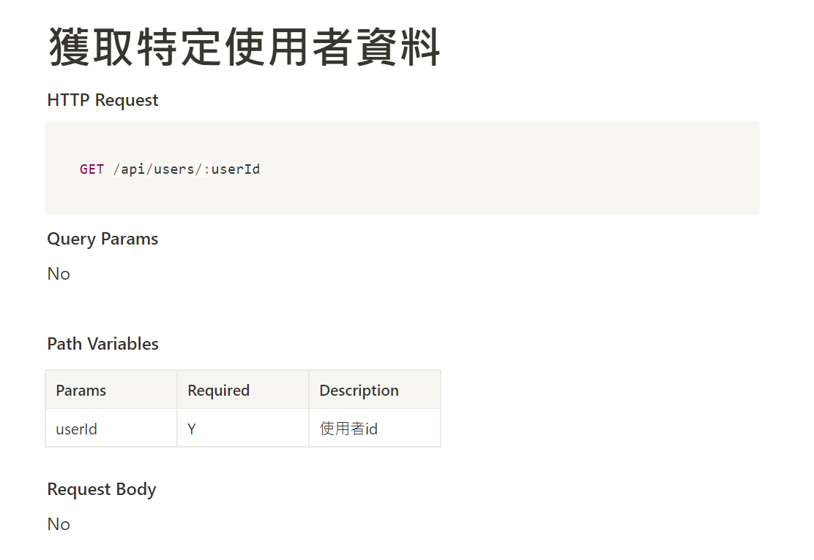

# AC-Twitter API



## About

An Restful API Server to acquire data for AC-finals Simple Twitter Project.
API documentation: https://www.notion.so/Twitter-API-3b9ea52b9c194b659551354690532360

### Functions

- Register with an personal account
  - User login/logout
  - Authentication
- Show list of all users expenses in index page
- Show total expenses of user
- Add new expense entries
- Edit type of expense
- Delete an expense
- Filter expense by type and show subtotal

## Installation

1. Check if node.js and npm is installed
2. Clone project to local
   ```bash
   git clone https://github.com/henrysmile2071/twitter-api-2020.git
   ```
3. Navigate to the project folder via the terminal, then install：

   ```bash
   npm install
   ```

4. Install MySQL Workbench: https://dev.mysql.com/downloads/workbench/ 

5. Create database via MySQL Workbench query (refer to ./config/config.json for naming):

   ~~~~sql
   drop database if exists ac_twitter_workspace;
   create database ac_twitter_workspace;
   use ac_twitter_workspace;
   ~~~~

7. Change to development Node (in Bash):

   ```bash
   export NODE_ENV=development
   ```

8. Migrate via bash:

   ```bash
   npx sequelize db:migrate
   ```

9. Run seeder: 

   ```bash
   npx sequelize db:seed:all
   ```

10. Then：

   ```bash
   npm run start
   ```

11. If the code is running successfully you should see message below:

   ```bash
   Example app listening on port 3000!
   ```

12. To stop the program:

   ```bash
   ctrl + c
   ```

## Tools
    "bcryptjs": "^2.4.3",
    "body-parser": "^1.18.3",
    "chai": "^4.2.0",
    "connect-flash": "^0.1.1",
    "cors": "^2.8.5",
    "dotenv": "^16.0.3",
    "express": "^4.16.4",
    "express-session": "^1.15.6",
    "faker": "^4.1.0",
    "imgur": "^1.0.2",
    "jsonwebtoken": "^8.5.1",
    "method-override": "^3.0.0",
    "mocha": "^6.0.2",
    "mysql2": "^1.6.4",
    "passport": "^0.4.0",
    "passport-jwt": "^4.0.0",
    "passport-local": "^1.0.0",
    "sequelize": "^6.6.5",
    "sequelize-cli": "^5.5.0",
    "sinon": "^10.0.0",
    "sinon-chai": "^3.3.0"
  
    "@types/cors": "^2.8.13",
    "eslint": "^8.29.0",
    "eslint-config-standard": "^17.0.0",
    "eslint-plugin-import": "^2.26.0",
    "eslint-plugin-n": "^15.6.0",
    "eslint-plugin-promise": "^6.1.1",
    "proxyquire": "^2.1.3",
    "sequelize-test-helpers": "^1.4.2",
    "supertest": "^3.3.0"