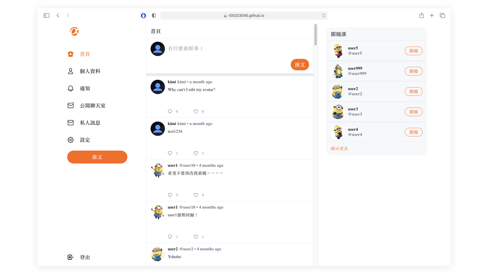
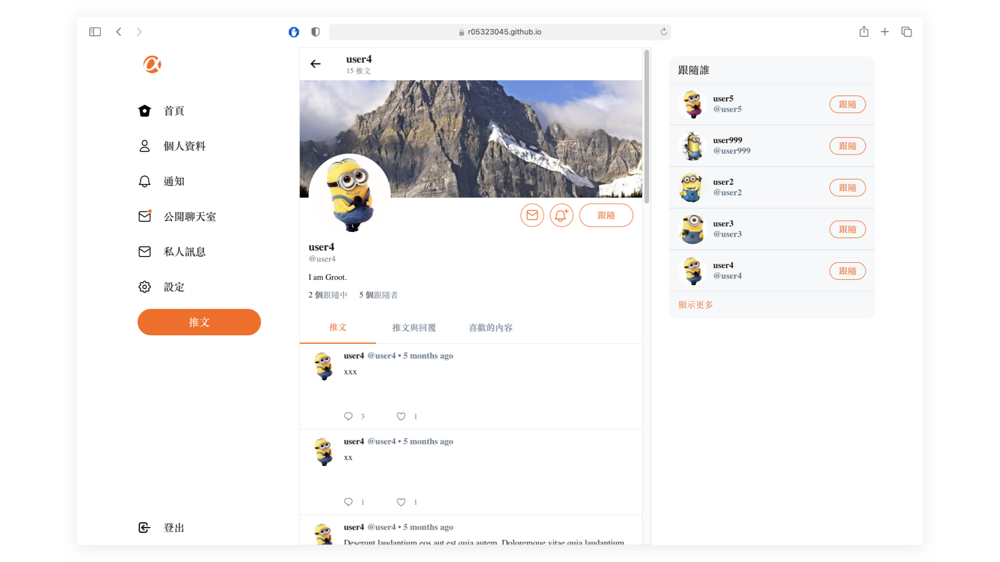
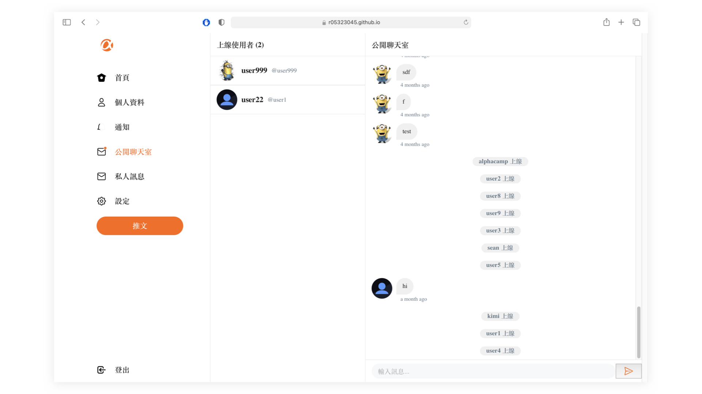
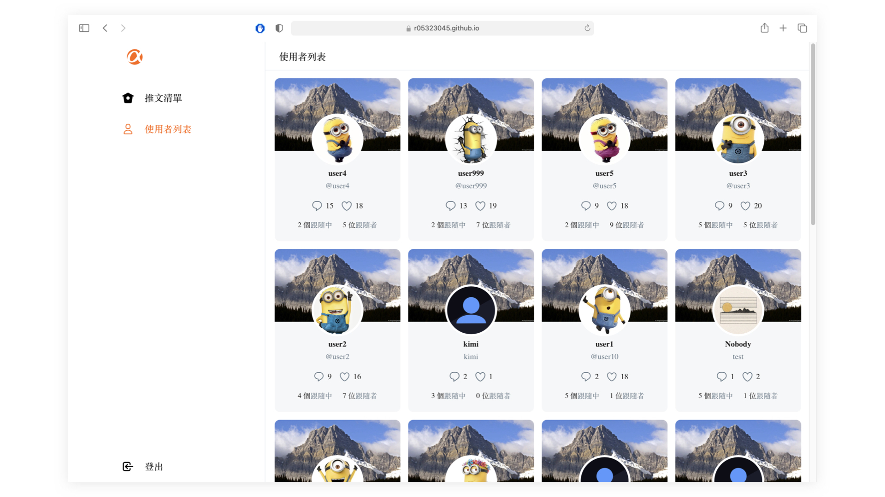

# Simple Twitter(Back-end)
Simple Twitter is inspired by [ALPHA Camp](https://tw.alphacamp.co/). It inclues the basic founction as an social platform, such as create/delete posts, like/unlike posts, follow/unfollow accounts, leave/delete comments and public/private chatroom.

<p align="left" style="margin-bottom: 0px">
  &#8594; <a  href="https://r05323045.github.io/twitter-api-2020-frontend/">Explore Simple Twitter Now!</a>
</p>

<p align="left">
  &#8594; <a  href="https://github.com/r05323045/twitter-api-2020-frontend">Check Out Front-end Repository</a>
</p>


## Table of Content
- [User Interface](#User-Interface)
- [Features](#Features)
- [RESTful APIs](#RESTful-APIs)
- [Third-party APIs and Open source used in this project](#Third-party-APIs-and-Open-source-used-in-this-project)

---

## User Interface
#### User Dashboard
<p>
  
</p>

#### Profile
<p>
  
</p>

#### Chatroom
<p>
  
</p>

#### Admin Dashboard
<p>
  
</p>
<br/><br/>

---

## Features

**Visitor**

As a visitor, you can:

1. Sign up for an account and join this platform
2. Explore tweets on this platform, including the content tweeted by yourself
3. Interact with users by Follow, Like, Reply and Chat 
4. Customize your profile by an avatar, cover, and self-introduction
5. Chat with users at an online chatroom
6. Send private messages to the users
7. Subscribe users and get notifications when they tweet, also you will receive notifications when your tweets get any response
8. Here is a user account you can use

|  account   | password  |
|  ----  | ----  |
| @user1  | 12345678 |

**Admin**

As an admin, you can:

1. Manage all tweets on this platform, deleting the tweet is available for the admin
2. Dashboard for observing all users, easy to find out who is an active user
3. Here is an admin account you can use

|  email   | password  |
|  ----  | ----  |
| root@example.com  | 12345678 |

---

## RESTful APIs
```text
api/
└── admin/
│   ├── signIn
│   ├── getTweets
│   ├── deleteTweet
│   ├── getUsers
└── user/
│   ├── signup
│   ├── signin
│   ├── getProfile
│   ├── getTopUser
│   ├── getTweets
│   ├── getUserReplies
│   ├── getUserLikes
│   ├── getSettingPage
│   ├── putSetting
└── follow/
│   ├── addFollowing
│   ├── removeFollowing
│   ├── getFollower
│   ├── getFollowing
└── like/
│   ├── likeTweet
│   ├── unlikeTweet
└── tweet/
│   ├── getTweets
│   ├── getTweet
│   ├── postTweet
│   ├── putTweet
│   ├── deleteSelfTweet
└── reply/
│   ├── postReply
│   ├── getReply
│   ├── putReply
│   ├── getSingleReply
└── chat/
│   ├── postChatRoom
│   ├── deleteChatRoom
│   ├── getChatRoom
│   ├── postMessage
│   ├── readMessages
│   ├── getUnreadMessages
└── subscribe/
    ├── addSubscribing
    ├── removeSubscribing
    ├── getNotifications
    └── readNotifications

```
---

## Third-party APIs and Open source used in this project

**Front-end**

- Using [Vue-cli](https://cli.vuejs.org/) for Vue.js project  management
- Using [Vuex](https://github.com/vuejs/vuex) for storing the user's state
- Using [vue-loading-overlay](https://github.com/ankurk91/vue-loading-overlay) to customize personal loading animation
- Using [Socket io](https://github.com/socketio/socket.io) for for send message to back-end
- Using [moment.js](https://github.com/moment/moment/) for parsing time and display the date range from now
- Using [Sweetalert2](https://github.com/sweetalert2/sweetalert2) to give tips to the user when they meet some problems

**Back-end**

- Using [JSON Web Tokens](https://jwt.io/) to build token based authentication
- Using [imgur-node-api](https://github.com/jamiees2/imgur-node-api) for uploading images
- Using [bcryptjs](https://github.com/dcodeIO/bcrypt.js) to encrypt the password
- Using [dotenv](https://github.com/motdotla/dotenv) to deal with the environment variables
- Using [Socket io](https://github.com/socketio/socket.io) for catching message from front-end

