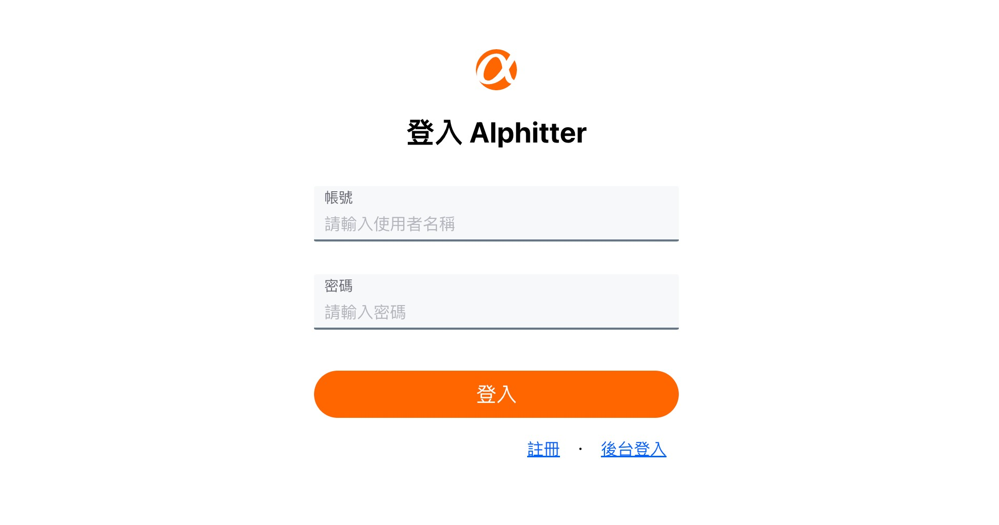

# Simple Twitter API

1. 提供網站**前台**註冊/登入/登出、新增推文與回覆、按讚推文、追蹤使用者、編輯個人資料等功能。
2. 提供網站**後台**管理使用者、刪除推文等功能。



## 使用方式

雲端服務：https://ac-twitter-12345.herokuapp.com

以下列 4 種路由為例：
| 類型    | Method     | 路由                               | 描述                             |
|---------|------------|-----------------------------------|----------------------------------|
| User    | GET        | /api/users/:id                    | 取得特定使用者 (查看個人頁面)      |
| User    | PUT        | /api/users/:id                    | 修改特定使用者 (編輯個人資料)      |
| Tweet   | POST       | /api/tweets                       | 新增推文                         |
| Admin   | DELETE     | /api/admin/tweets/:id             | 刪除特定推文                     |

1. 安裝 axios 套件
```
npm install axios
```
2. 基本應用
```
import axios from 'axios'
const baseURL = "https://ac-twitter-12345.herokuapp.com/api"

(查看)
const res = await axios.get(`${baseUrl}/users/:id`)
// res = { id: ..., email: ..., name: ... }

(修改)
axios.put(`${baseUrl}/users/:id`, {
  introduction: 'introduction'
})

(新增)
axios.post(`${baseUrl}/tweets`, {
  description: 'description'
})

(刪除) 
axios.delete(`${baseUrl}/admin/tweets/:id`)
```

本地服務

1. 開啟終端機(Terminal)，clone 此專案至本機電腦
```
git clone https://github.com/ElynnaChuang/twitter-api-2020.git
```

2. 初始化
```
cd twitter-api-2020  // 進入存放位置的資料夾
npm install  // 安裝套件
```

3. 開啟 config.json 檔，設定資料庫帳號、密碼以及資料庫名稱 (預設使用開發環境)
```
"development": {
  "username": "username",
  "password": "password",
  "database": "database_name",
  "host": "127.0.0.1",
  "dialect": "mysql"
}
```

4. 開啟 MySQL Workbench，依 config.json 檔設定連線、新增資料庫
```
create database database_name;
```

5. 新增資料表
```
npx sequelize db:migrate
```

6. 新增種子資料
```
npx sequelize db:seed:all
```
```
(一般使用者)
帳號: user1
密碼: 12345678

(管理者)
帳號: root
密碼: 12345678
```

7. 新增 .env 檔，設定環境變數
```
JWT_SECRET=
```

8. 啟動程式
```
npm run dev
```

9. 終端顯示以下畫面即啟動完成，請將串接網址 (baseURL) 設定為 http://localhost:3000/api
```
Example app listening on port 3000!
```

10. 結束程式
```
ctrl + c
```
